# Expense-Tracker-for-Lazy-People 懶人記帳
## Menu - 目錄
- [Demo - 專案畫面](#demo---專案畫面)
- [use_fastapi - 使用說明](#use_fastapi---使用說明)
- [Features - 產品功能](#feature-demo---功能展示)
- [Installing - 專案安裝流程](#installing---專案安裝流程)
- [program-logic - 程式邏輯](#program-logic---程式邏輯)
  - [主程式邏輯](#主程式邏輯)
  - [登入/註冊邏輯](#登入註冊邏輯)
  - [RESTful Router 路由設計](#restful-router-路由設計)
- [Feature-Demo - 功能展示](#feature-demo---功能展示)
- [Dependencies - 使用套件](#dependencies---使用套件)
- [Creator - 作者](#creator---作者)
## Demo - 專案畫面
- Medium部落格介紹: [點我](https://medium.com/@tinymurky/%E5%B0%88%E6%A1%88-%E8%A8%98%E5%B8%B3%E7%B6%B2%E7%AB%99-%E6%88%91%E7%9A%84%E7%A7%81%E6%88%BF%E9%8C%A2-5ec064eab541)
- AWS部屬(使用以下帳號密碼體驗): [點我](http://ec2-35-78-73-49.ap-northeast-1.compute.amazonaws.com/users/login)
  - Email : root@example.com
  - Password: 12345678

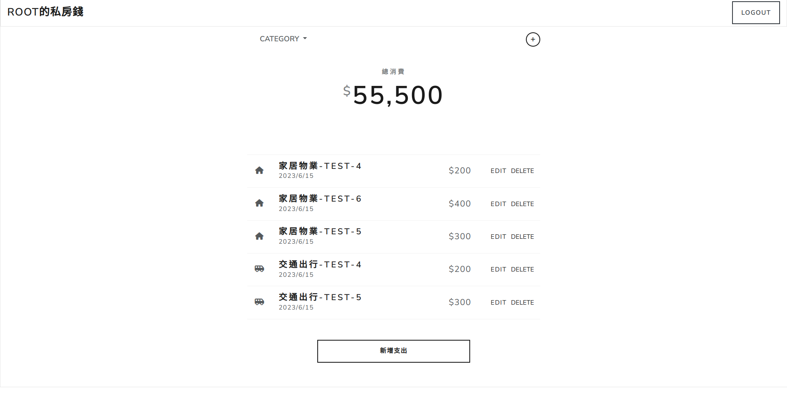

## use_fastapi - 使用說明
1. 安裝fastapi：
    ```
    pip install fastapi uvicorn 
    ```
2. 開始使用fastapi：
    ```
    python -m uvicorn main:app --reload
    ```
### 安裝上遇到問題可以嘗試使用虛擬機
1. 建立venv：
    ```
    python -m venv venv
    ```
2. 開啟虛擬機：
    ```
    .\venv\Scripts\activate
    ```
3. 第一次建立要安裝需要的安裝包：
    ```
    pip install fastapi uvicorn
    pip install IPython
    pip install requests
    pip install imgurpython
    pip install opencv-python
    pip install openai
    ```

## Features - 產品功能
使用者可以：
- 註冊帳號
    - 註冊之後，可以登入/登出
    - 可使用Google與Github帳號註冊/登入
    - 只有登入狀態的使用者可以看到 app 內容，否則一律被導向登入頁

- 在首頁一次瀏覽所有支出的清單
    - 使用者只能看到自己建立的資料

- 在首頁看到所有支出清單的總金額

- 可以看到各天花費支出總和

- 根據「類別」篩選支出；總金額與各天支出總和的計算只會包括被篩選出來的金額

- 新增一筆支出

- 編輯支出的屬性

- 刪除任何一筆支出


## Installing - 專案安裝流程
1. 請先確認有安裝 node.js 與 npm
2. 創造一個專案資料夾，打開您的 terminal，使用`cd`指令進入您剛創建的資料夾
3. Clone 此專案至本機電腦將專案 clone 到本地
    ```
    git clone https://github.com/TinyMurky/expense-tracker.git
    ```
4. CD進入您剛剛建立的資料夾，輸入以下指令自動安裝所需套件
    ```
    npm install
    ```
5. 我們需要連結到MongoDB，您需要先於[MongoDB](https://www.mongodb.com/)建立您的Cluster，並於畫面左上角的Database=>Connect 取得雲端DB連結。

    
6. 建立 `.env` 檔:
    - 專案根目錄的檔案`.env.example`，將檔案名`.example`刪除後，使用文字編輯器打開。
    - 打開後請更改以下項目(刪除SKIP，並於單引號內輸入字串)：
        ```
        GITHUB_CLIENT_ID='SKIP'
        GITHUB_CLIENT_SECRET='SKIP'
        GOOGLE_CLIENT_ID='SKIP'
        GOOGLE_CLIENT_SECRET='SKIP'
        MONGODB_URL=mongodb+srv://<您的帳號名稱>:<password>@<您的Cluster連結>/restaurants?retryWrites=true&w=majority
        ```
    - GITHUB_CLIENT_ID, GITHUB_CLIENT_SECRET 請於 [Github register a new OAuth application](https://github.com/settings/applications/new) 申請一組Client ID與Client secrets，申請時請於`Authorization callback URL` 填寫`http://localhost:3000/auth/github/callback`
    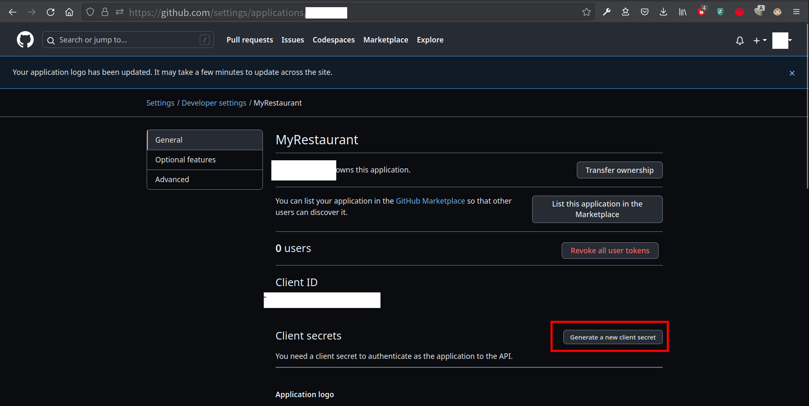

    - GOOGLE_CLIENT_ID, GOOGLE_CLIENT_SECRET請於 [Google Developers Console](https://console.cloud.google.com/projectselector2/apis/dashboard?pli=1&supportedpurview=project)申請一組OAuth 2.0用戶端ID與金鑰，設定時`已授權的重新導向URI`請填寫`http://localhost:3000/auth/google/callback`
    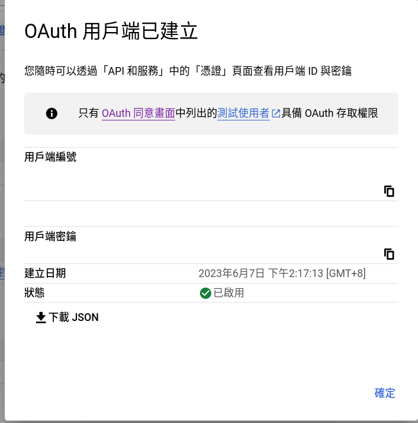

    - 於第5點建立Cluster後，請把.env中`MONGODB_URL`以下的`<>`內的資訊替代成您的資訊（`<>`不需要留）
        ```
        mongodb+srv://<您的帳號名稱>:<password>@<您的Cluster連結>/restaurants?retryWrites=true&w=majority
        ```

7. 建立預設資料
    請於專案根目錄中使用終端機輸入以下指令，將預設資料輸入您的資料庫，第一次執行前請**務必執行**，支出類別必須使用此指令建立。
    ```
    npm run seed
    ```
    seed提供一組預設帳號可供登入，內有測試用支出
    
    ||Name|Email|Password|
    |:--|:--|:--|:--|
    |1|root|root@example.com|12345678|

8. 建立完畢後，繼續於終端機輸入：
    ```
    npm run start
    ```

9. 若看見此行訊息則代表順利運行，打開瀏覽器進入到以下網址:
    ```
    Mongodb connected successfully
    Port: 3000 started
    ```

10. 若欲暫停請於終端機使用:
    ```
    ctrl + c
    ```
## Program Logic - 程式邏輯

### 主程式邏輯
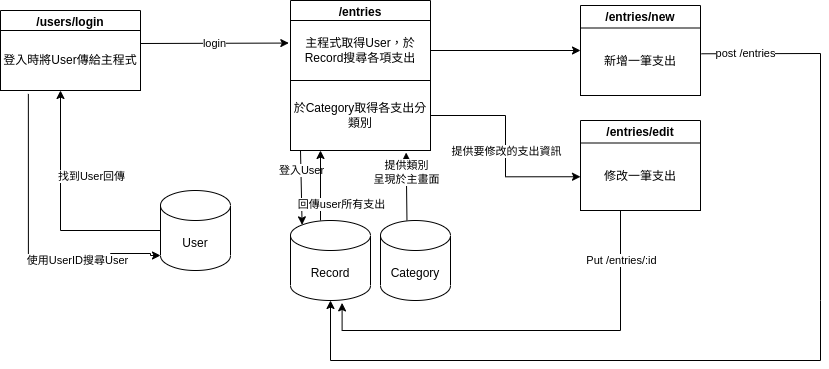
- 登入成功將User物件傳遞給server
- server使用user物件的ID將所有該user的支出傳給主畫面`/entries`
- 於新增畫面`/entries/new`新增一筆支出，將支出存於資料庫的Record collection中並重新導向至主畫面`/entries`
- 於修改畫面`/entries/:id/edit`修改一筆支出，支出原始內容於資料庫的Record collection中取得，修改後重新導向至主畫面`/entries`


### 登入/註冊邏輯
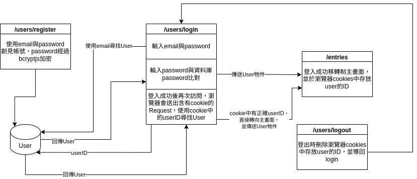
由於html request是無狀態 (stateless)，每次request都是一筆獨立項目，與其他request無關，因此想要記住使用者已登入，需要將登入資訊存放於cookie，並於request時一起附上。

#### 各項說明
- `users/register`頁面，提供email與password，password經過bcryptjs雜湊後存放於資料庫User collection
- `users/login`頁面，提供email與password，password經過bcryptjs雜湊後與資料庫中的user比對
- 如果登入成功，將userID以cookie的形式存放於使用者的瀏覽器
- 下次使用者再次訪問網站時，html request會議起傳送cookie，server獲得userID後於資料庫尋找user，若user存在則直接移轉制主畫面
- `users/logout`將會刪除瀏覽器中的cookie，使下次訪問時不能自動認證

### RESTful Router 路由設計
|movement|method|router|
|:--|:--|:--|
|呈現全部花費|GET|`/entries`|
|呈現新增花費的畫面|GET|`/entries/new`|
|新增一筆花費|POST|`/entries`|
|呈現修改花費的畫面|GET|`/entries/:id/edit`|
|修改一筆花費|PUT|`/entries/:id`|
|刪除一筆花費|DELETE|`/entries/:id`|
|呈現登入畫面|GET|`/users/login`|
|登入|POST|`/users/login`|
|呈現註冊帳號頁面|GET|`/users/register`|
|註冊帳號|POST|`/users/register`|
|登出|GET|`/users/logout`|
|呼叫github OAuth2|GET|`/auth/github`|
|github回傳登入資訊|GET|`/auth/github/callback`|
|呼叫Google OAuth2|GET|`/auth/google`|
|google回傳登入資訊|GET|`/auth/google/callback`|


## Feature Demo - 功能展示

### 主畫面
- 畫面中央呈現所有支出加總
- 支出列表中有每日花費加總
- 可依照類別單獨顯示特定類別支出，上面兩項數字也依照類別改變
- RWD畫面，小螢幕也可使用

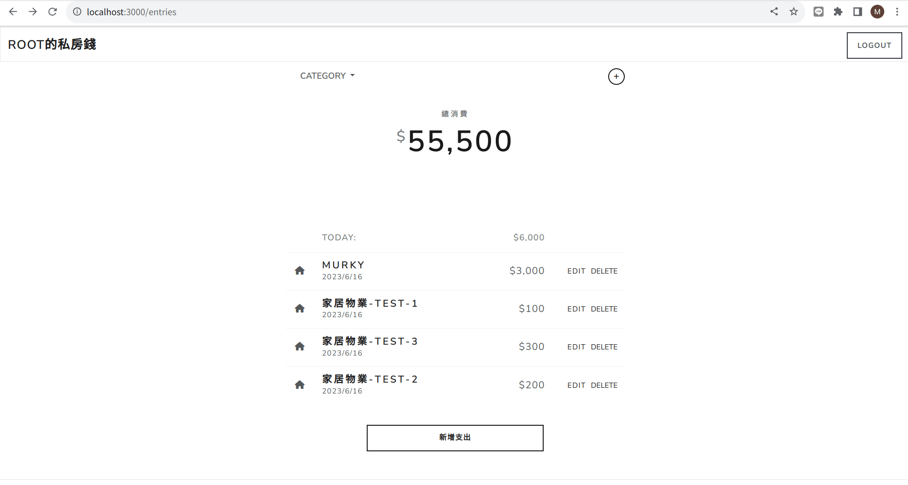

### 新增
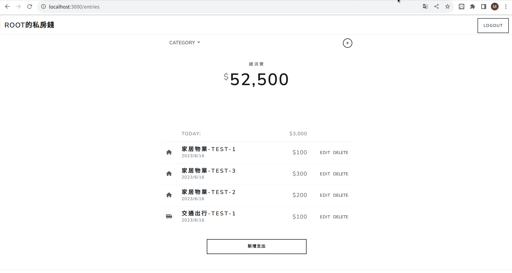

### 修改
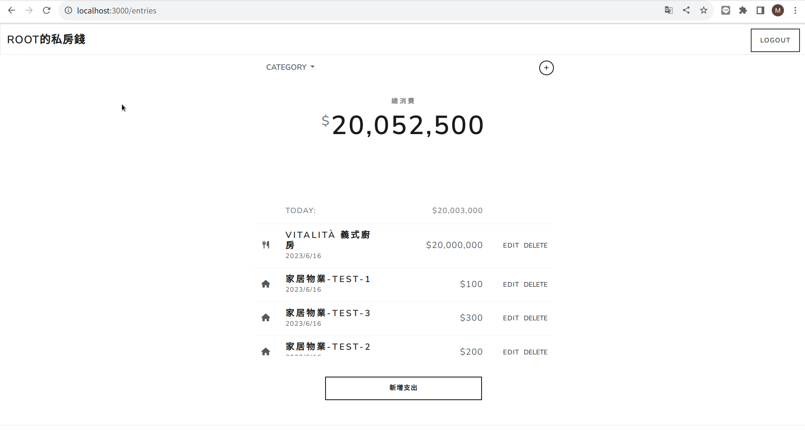

### 刪除
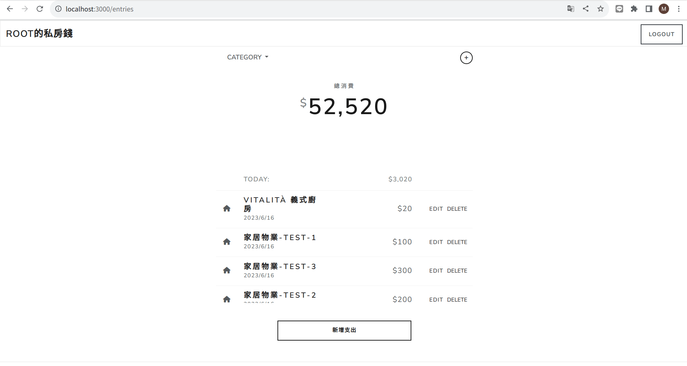

### 註冊
- 可用信箱、密碼註冊，也可以使用google、github註冊，輸入錯誤有警示字樣

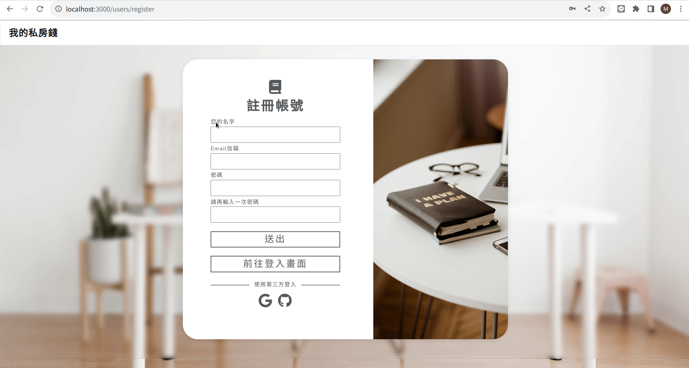
### 登入
- 可用信箱、密碼登入，也可以使用google、github登入，輸入錯誤有警示字樣

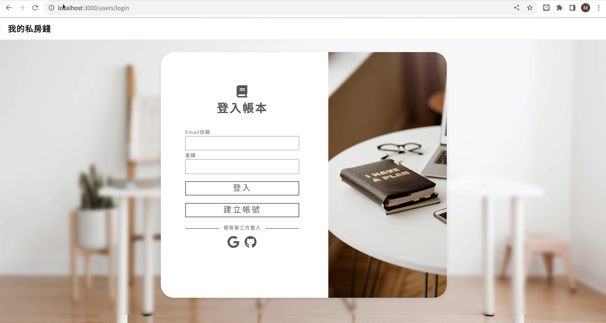
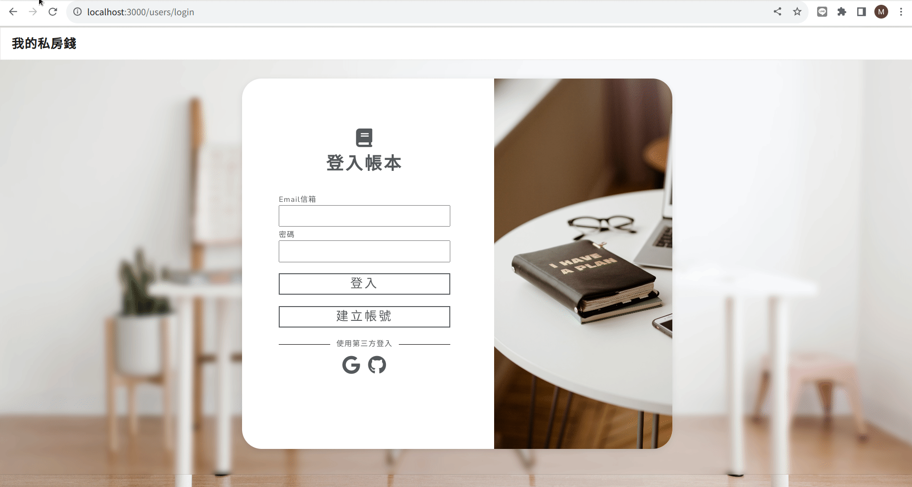
### 登出
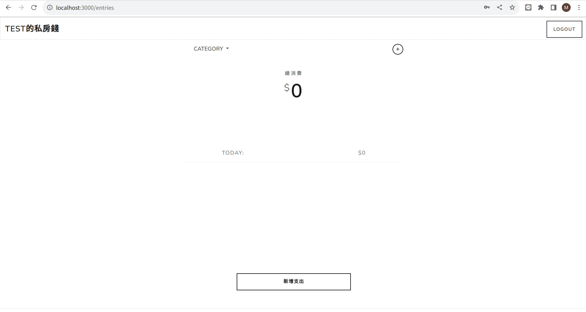

## Dependencies - 使用套件
- bcryptjs: 2.4.3
- connect-flash: 0.1.1
- dotenv: 16.1.4
- express: 4.18.2
- express-handlebars: 7.0.7
- express-session: 1.17.3
- method-override: 3.0.0
- nanoid: 4.0.2
- passport: 0.6.0
- passport-github2: 0.1.12
- passport-google-oauth20: 2.0.0
- passport-local: 1.0.0

## Creator - 作者
- Tiny_Murky
